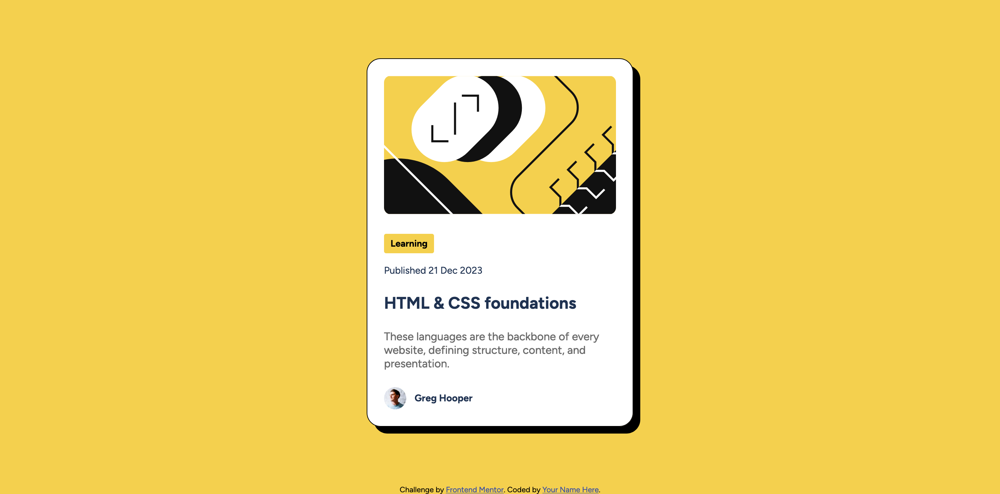

# Frontend Mentor - Blog preview card solution

This is a solution to the [Blog preview card challenge on Frontend Mentor](https://www.frontendmentor.io/challenges/blog-preview-card-ckPaj01IcS). Frontend Mentor challenges help you improve your coding skills by building realistic projects. 

## Table of contents

- [Overview](#overview)
  - [The challenge](#the-challenge)
  - [Screenshot](#screenshot)
  - [Links](#links)
- [My process](#my-process)
  - [Built with](#built-with)
  - [What I learned](#what-i-learned)
  - [Useful resources](#useful-resources)
- [Author](#author)

## Overview

### The challenge

Users should be able to:

- See hover and focus states for all interactive elements on the page

### Screenshot



### Links

- Solution URL: [Add solution URL here](https://github.com/ardolynk-reborn/frontend-mentor/blog-preview-card-main)
- Live Site URL: [Add live site URL here](https://ardolynk-reborn.github.io/frontend-mentor/blog-preview-card-main)

## My process

### Built with

- Semantic HTML5 markup
- CSS custom properties
- Flexbox
- CSS Grid
- Mobile-first workflow

### What I learned

Here we use CSS pseudo-classes and (stubbed) JS handlers for user interaction.

```html
  <div class="card">
    
    <button onclick="learnMore(this)">Learning</button>
    <small>Published 21 Dec 2023</small>
    <h2 class="article-ref" onclick="showArticle(this)">HTML & CSS foundations</h2>
    <p>These languages are the backbone of every website, defining structure, content, and presentation.</p>
    <div class="author" onclick="showProfile(this)">
      
      <h3>Greg Hooper</h3>
    </div>
  </div>
```
```css
.card button:hover, .card button:focus {
  cursor: pointer;
  color: #f4d04e;
  background-color: black;
}

.article-ref:hover, .author:hover {
  cursor: pointer;
  color: #f4d04e;
}
```
```js
const learnMore = (sender) => {
  // Stub
  window.alert('Learn more');
  sender?.blur();
}

const showArticle = (sender) => {
  // Stub
  window.alert('Show article');
  sender?.blur();
}

const showProfile = (sender) => {
  // Stub
  window.alert('Show profile');
  sender?.blur();
}
```

### Useful resources

- [Mozilla Developers Network](https://developer.mozilla.org) - One of the most exhausting HTML/CSS/JS references.

## Author

- GitHub - [@ardolynk-reborn](https://github.com/ardolynk-reborn)
- Frontend Mentor - [@ardolynk-reborn](https://www.frontendmentor.io/profile/ardolynk-reborn)
- Twitter - [@ardolynk75](https://x.com/ardolynk75)
