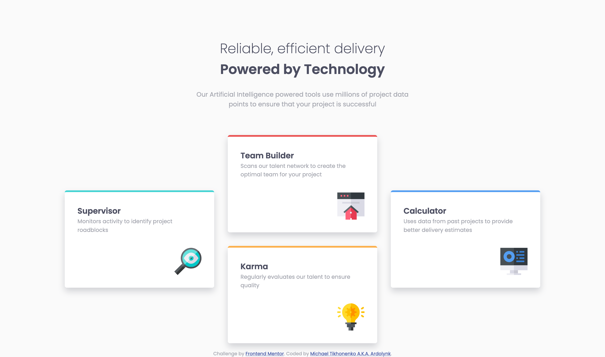

# Frontend Mentor - Four card feature section solution

This is a solution to the [Four card feature section challenge on Frontend Mentor](https://www.frontendmentor.io/challenges/four-card-feature-section-weK1eFYK). Frontend Mentor challenges help you improve your coding skills by building realistic projects. 

## Table of contents

- [Overview](#overview)
  - [The challenge](#the-challenge)
  - [Screenshot](#screenshot)
  - [Links](#links)
- [My process](#my-process)
  - [Built with](#built-with)
  - [What I learned](#what-i-learned)
  - [Continued development](#continued-development)
  - [Useful resources](#useful-resources)
- [Author](#author)

## Overview

### The challenge

Users should be able to:

- View the optimal layout for the site depending on their device's screen size

### Screenshot



### Links

- Solution URL: [Four card feature section source code](https://github.com/ardolynk-reborn/frontend-mentor/tree/main/four-card-feature-section-main)
- Live Site URL: [Four card feature section live](https://ardolynk-reborn.github.io/frontend-mentor/four-card-feature-section-main)

## My process

### Built with

- Semantic HTML5 markup
- CSS custom properties
- Flexbox
- CSS Grid
- Mobile-first workflow

### What I learned

For larger screens I used a grid layout and 

```html
    <section class="cards">
      <div class="card supervisor">
        <h3>Supervisor</h3>
        <p>Monitors activity to identify project roadblocks</p>
        
      </div>
      <div class="card team-builder">
        <h3>Team Builder</h3>
        <p>Scans our talent network to create the optimal team for your project</p>
        
      </div>
      <div class="card karma">
        <h3>Karma</h3>
        <p>Regularly evaluates our talent to ensure quality</p>
        
      </div>
      <div class="card calculator">
        <h3>Calculator</h3>
        <p>Uses data from past projects to provide better delivery estimates</p>
        
      </div>
    </section>
```
```css
@media (min-width: 48em) {

  .cards {
    display: grid;
    grid-template-columns: repeat(3, 1fl);
    grid-template-rows: repeat(4, 1fl);
  }

  .card {
    margin: 16px;
  }

  .supervisor {
    grid-row: 2 / 4;
    grid-column: 1;
  }

  .team-builder {
    grid-row: 1 / 3;
    grid-column: 2;
  }

  .karma {
    grid-row: 3 / 5;
    grid-column: 2;
  }

  .calculator {
    grid-row: 2 / 4;
    grid-column: 3
  }
}
```

### Continued development

Still not sure with grid layout shorthands, also haven't used CSS preprocessing yet.

### Useful resources

- [An Interactive Guide to CSS Grid](https://www.joshwcomeau.com/css/interactive-guide-to-grid/) - This helped me organize cards grid layout.

## Author

- GitHub - [@ardolynk-reborn](https://github.com/ardolynk-reborn)
- Frontend Mentor - [@ardolynk-reborn](https://www.frontendmentor.io/profile/ardolynk-reborn)
- Twitter - [@ardolynk75](https://x.com/ardolynk75)
