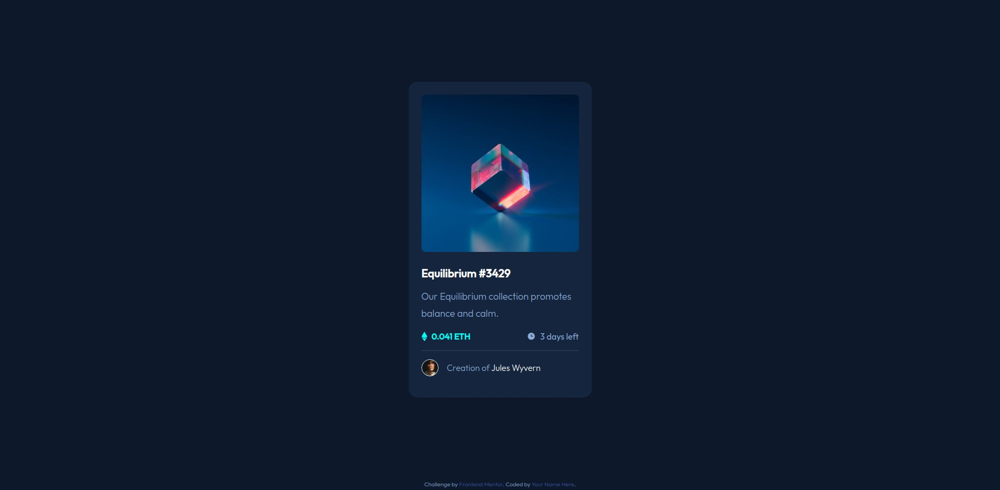

# Frontend Mentor - NFT preview card component solution

This is a solution to the [NFT preview card component challenge on Frontend Mentor](https://www.frontendmentor.io/challenges/nft-preview-card-component-SbdUL_w0U). Frontend Mentor challenges help you improve your coding skills by building realistic projects. 

## Table of contents

- [Overview](#overview)
  - [The challenge](#the-challenge)
  - [Screenshot](#screenshot)
  - [Links](#links)
- [My process](#my-process)
  - [Built with](#built-with)
  - [What I learned](#what-i-learned)
  - [Useful resources](#useful-resources)
- [Author](#author)

**Note: Delete this note and update the table of contents based on what sections you keep.**

## Overview

### The challenge

Users should be able to:

- View the optimal layout depending on their device's screen size
- See hover states for interactive elements

### Screenshot



**Note: Delete this note and the paragraphs above when you add your screenshot. If you prefer not to add a screenshot, feel free to remove this entire section.**

### Links

- Solution URL: [Add solution URL here](https://github.com/ardolynk-reborn/frontend-mentor/tree/main/nft-preview-card-component-main)
- Live Site URL: [Add live site URL here](https://ardolynk-reborn.github.io/frontend-mentor/nft-preview-card-component-main)

## My process

### Built with

- Semantic HTML5 markup
- CSS custom properties
- Flexbox
- Mobile-first workflow
- [Sass](https://sass-lang.com/) - CSS preprocessor

### What I learned

Here I tried to apply SMACSS approach to the page design. The smaller part is in the base section

```sass
*
  margin: 0
  padding: 0
  box-sizing: border-box

body
  min-height: 100vh
  display: flex
  flex-direction: column
  color: variables.$color-main
  background-color: variables.$color-bg-main
  font-family: "Outfit", serif
  font-weight: 300
  font-size: 16px
  line-height: 1.8

h3
  font-size: 1.3rem
  font-weight: 600

a
  color: variables.$color-bright
  text-decoration: none
  &:hover
    color: variables.$color-active

hr
  border: none
  height: 1px
  background-color: variables.$color-line
```
and almost all the rest I placed in modules.

### Useful resources

- [SMACSS](https://www.smacss.com) - One of the major Web style guides.

## Author

- GitHub - [@ardolynk-reborn](https://github.com/ardolynk-reborn)
- Frontend Mentor - [@ardolynk-reborn](https://www.frontendmentor.io/profile/ardolynk-reborn)
- Twitter - [@ardolynk75](https://x.com/ardolynk75)
