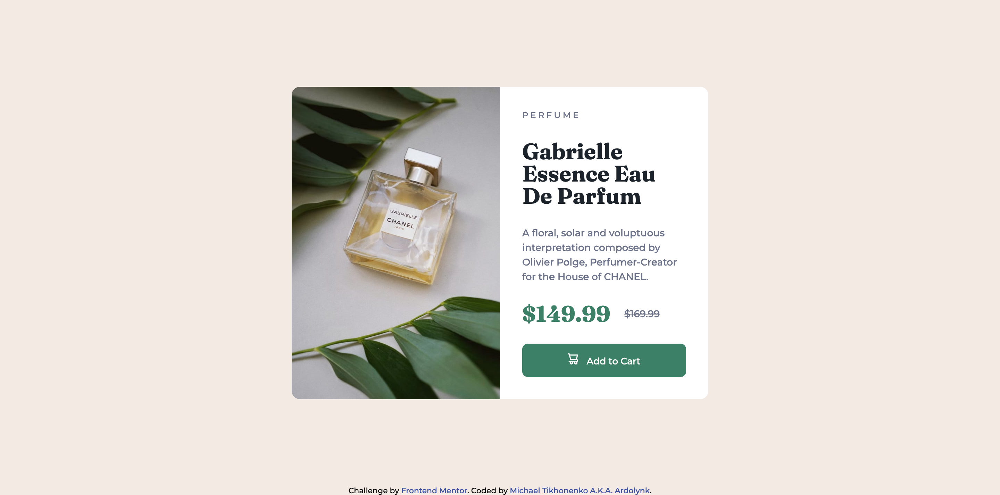

# Frontend Mentor - Product preview card component solution

This is a solution to the [Product preview card component challenge on Frontend Mentor](https://www.frontendmentor.io/challenges/product-preview-card-component-GO7UmttRfa). Frontend Mentor challenges help you improve your coding skills by building realistic projects. 

## Table of contents

- [Overview](#overview)
  - [The challenge](#the-challenge)
  - [Screenshot](#screenshot)
  - [Links](#links)
- [My process](#my-process)
  - [Built with](#built-with)
  - [What I learned](#what-i-learned)
  - [Continued development](#continued-development)
  - [Useful resources](#useful-resources)
- [Author](#author)

## Overview

### The challenge

Users should be able to:

- View the optimal layout depending on their device's screen size
- See hover and focus states for interactive elements

### Screenshot



### Links

- Solution URL: [Product preview card source code](https://github.com/ardolynk-reborn/frontend-mentor/tree/main/product-preview-card-component-main)
- Live Site URL: [Product preview card live](https://ardolynk-reborn.github.io/frontend-mentor/product-preview-card-component-main)

## My process

### Built with

- Semantic HTML5 markup
- CSS custom properties
- Flexbox
- Mobile-first workflow

### What I learned

Here I had more fun with `flex-grow` and `justify-content` attributes. Also a product image source should be altered depending on window width.

```html
  <main>
    <div class="card">
      
      <div class="info">
        <p class="category">Perfume</p>
        <h1>Gabrielle Essence Eau De Parfum</h1>
        <p>
          A floral, solar and voluptuous interpretation composed by Olivier Polge,
          Perfumer-Creator for the House of CHANEL.
        </p>
        <div class="price">
          <h1 class="actual">$149.99</h1>
          <p class="old">$169.99</p>
        </div>
        <button>Add to Cart</button>
      </div>
    </div>
  </main> 
```
```css
.card {
  margin: 28px 16px 28px 16px;
  flex-grow: 1;
  display: flex;
  flex-direction: column;
  background-color: white;
  border-radius: 12px;
  overflow: hidden;
}

.product {
  width: 100%;
  height: auto;
  content: url(./images/image-product-mobile.jpg);
}

.info {
  margin: 24px;
  display: flex;
  flex-direction: column;
  flex-grow: 1;
  justify-content: space-between;
}

.price {
  display: flex;
  direction: row;
  align-items: center;
}

/* Desktop version */
@media (min-width: 36em) {
  .card {
    flex-direction: row;
    width: 37.5em;
    height: 28.125em;
    flex-grow: 0;
  }

  .info {
    margin: 32px;
  }

  .product {
    width: auto;
    height: 100%;
    content: url(./images/image-product-desktop.jpg);
  }
}
```

### Continued development

I still need to get into CSS preprocessing with SASS or Stylus.

### Useful resources

- [web.dev](https://web.dev) - Another helpful resource about HTML / CSS / JS.

## Author

- GitHub - [@ardolynk-reborn](https://github.com/ardolynk-reborn)
- Frontend Mentor - [@ardolynk-reborn](https://www.frontendmentor.io/profile/ardolynk-reborn)
- Twitter - [@ardolynk75](https://x.com/ardolynk75)
