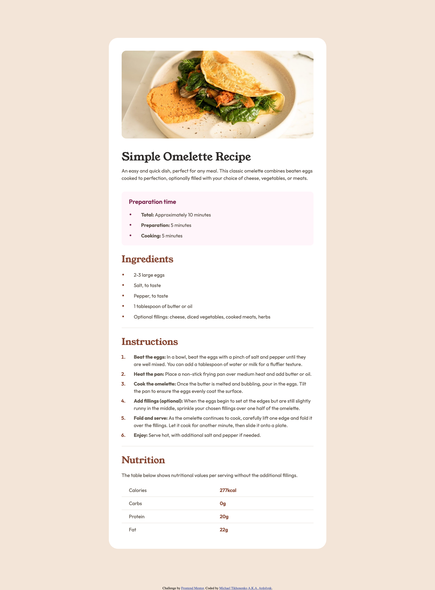

# Frontend Mentor - Recipe page solution

This is a solution to the [Recipe page challenge on Frontend Mentor](https://www.frontendmentor.io/challenges/recipe-page-KiTsR8QQKm). Frontend Mentor challenges help you improve your coding skills by building realistic projects. 

## Table of contents

- [Overview](#overview)
  - [The challenge](#the-challenge)
  - [Screenshot](#screenshot)
  - [Links](#links)
- [My process](#my-process)
  - [Built with](#built-with)
  - [What I learned](#what-i-learned)
  - [Continued development](#continued-development)
- [Author](#author)
- [Acknowledgments](#acknowledgments)

## Overview

### Screenshot



### Links

- Solution URL: [Recipe page source code](https://github.com/ardolynk-reborn/frontend-mentor/tree/main/recipe-page-main)
- Live Site URL: [Recipe page live](https://ardolynk-reborn.github.io/frontend-mentor/recipe-page-main)

## My process

### Built with

- Semantic HTML5 markup
- CSS custom properties
- Flexbox
- Mobile-first workflow

### What I learned

The hardest challenges of this lesson were connected with lists and table formatting. To center list markers vertically we need to put an item content into a span then apply some specific style attributes.

```html
  <ul>
    <li><span><strong>Total: </strong>Approximately 10 minutes</span></li>
    <li><span><strong>Preparation: </strong>5 minutes</span></li>
    <li><span><strong>Cooking: </strong>5 minutes</span></li>
  </ul>
```
```css
.preparation-time li > span {
  display: inline-block;
  vertical-align: middle;
}

.preparation-time li::marker {
  color: #7b284f;
}
```

There are more settings needed to properly break the table with horizontal rules.

```html
  <table class="nutrition">
    <tr>
      <td class="nutrition-unit">Calories</td>
      <td class="nutrition-value">277kcal</td>
    </tr>
    <tr>
      <td class="nutrition-unit">Carbs</td>
      <td class="nutrition-value">0g</td>
    </tr>
    <tr>
      <td class="nutrition-unit">Protein</td>
      <td class="nutrition-value">20g</td>
    </tr>
    <tr>
      <td class="nutrition-unit">Fat</td>
      <td class="nutrition-value">22g</td>
    </tr>
  </table>
```
```css
.nutrition {
  width: 100%;
  border-collapse: collapse;
}

.nutrition tr {
  line-height: 42px;
  border-bottom: 1px solid #e4ded8;
}

.nutrition tr:last-child {
  border-bottom: none;
}
```

### Continued development

This should be the last newbie assessment. I'm anxious to get more advanced frontend experience.

## Author

- GitHub - [@ardolynk-reborn](https://github.com/ardolynk-reborn)
- Frontend Mentor - [@ardolynk-reborn](https://www.frontendmentor.io/profile/ardolynk-reborn)
- Twitter - [@ardolynk75](https://x.com/ardolynk75)

## Acknowledgments

Thanks to "I don't know shite" blog for suggestions [how to center list bullets vertically](https://idkshite.com/posts/vertical-center-bullet).
