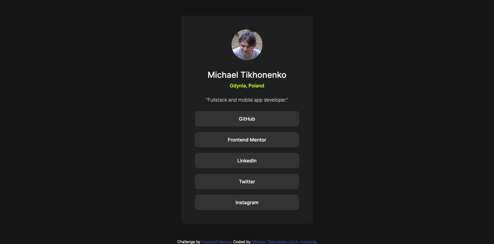

# Frontend Mentor - Social links profile solution

This is a solution to the [Social links profile challenge on Frontend Mentor](https://www.frontendmentor.io/challenges/social-links-profile-UG32l9m6dQ). Frontend Mentor challenges help you improve your coding skills by building realistic projects. 

## Table of contents

- [Overview](#overview)
  - [The challenge](#the-challenge)
  - [Screenshot](#screenshot)
  - [Links](#links)
- [My process](#my-process)
  - [Built with](#built-with)
  - [What I learned](#what-i-learned)
- [Author](#author)

**Note: Delete this note and update the table of contents based on what sections you keep.**

## Overview

### The challenge

Users should be able to:

- See hover and focus states for all interactive elements on the page

### Screenshot



### Links

- Solution URL: [Social links profile source code](https://github.com/ardolynk-reborn/frontend-mentor/tree/main/social-links-profile-main)
- Live Site URL: [Social links profile live](https://ardolynk-reborn.github.io/frontend-mentor/social-links-profile-main)

## My process

### Built with

- Semantic HTML5 markup
- CSS custom properties
- Flexbox
- CSS Grid
- Mobile-first workflow

### What I learned

Here we use buttons to follow links. IMHO it's better to open these links in new tabs.

```html
  <div class="links">
    <a href="https://github.com/ardolynk-reborn" target="_blank">
      <button>GitHub</button>
    </a>
    <a href="https://www.frontendmentor.io/profile/ardolynk-reborn" target="_blank">
      <button>Frontend Mentor</button>
    </a>
    <a href="https://www.linkedin.com/in/michaeltikhonenko" target="_blank">
      <button>LinkedIn</button>
    </a>
    <a href="https://x.com/ardolynk75" target="_blank">
      <button>Twitter</button>
    </a>
    <a href="https://www.instagram.com/ardolynk" target="_blank">
      <button>Instagram</button>
    </a>
  </div>
```

## Author

- GitHub - [@ardolynk-reborn](https://github.com/ardolynk-reborn)
- Frontend Mentor - [@ardolynk-reborn](https://www.frontendmentor.io/profile/ardolynk-reborn)
- Twitter - [@ardolynk75](https://x.com/ardolynk75)
